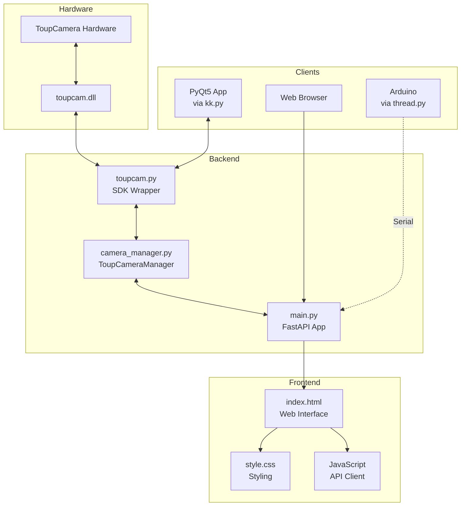

# ToupCamera Web Streaming Application - Project Report

## 📋 Table of Contents
1. [Project Overview](#project-overview)
2. [Technology Stack](#technology-stack)
3. [Project Structure](#project-structure)
4. [Core Components](#core-components)
5. [API Reference](#api-reference)
6. [User Interface](#user-interface)
7. [Utility Scripts](#utility-scripts)
8. [Dependencies](#dependencies)
9. [Getting Started](#getting-started)
10. [Architecture Diagram](#architecture-diagram)

---

## 📌 Project Overview

This project is a **real-time video streaming and image capture web application** built using **FastAPI** and the **ToupCam SDK**. It enables users to:

- Stream live video from ToupCam microscope/scientific cameras via a web browser
- Capture high-resolution still images using hardware snap functionality
- Control camera settings (exposure, gain, white balance, resolution) through a modern web interface
- Support both USB and GigE camera connections

### Key Features
| Feature | Description |
|---------|-------------|
| **MJPEG Streaming** | Real-time video streaming at up to ~120 FPS |
| **Dual Resolution** | Low-res for fast streaming, high-res for captures |
| **Thread-Safe Design** | Background polling thread for frame acquisition |
| **Web-Based Controls** | Modern dark-themed UI with full camera controls |
| **Arduino Integration** | Serial communication support for hardware triggers |
| **Auto/Manual Controls** | Auto-exposure, auto white balance, and manual overrides |

---

## 🛠️ Technology Stack

| Category | Technology |
|----------|------------|
| **Backend Framework** | FastAPI 2.0 |
| **Camera SDK** | ToupCam SDK (toupcam.dll/toupcam.py) |
| **Image Processing** | Pillow (PIL) |
| **Template Engine** | Jinja2 |
| **Web Server** | Uvicorn (ASGI) |
| **Frontend** | HTML5, CSS3, JavaScript |
| **Fonts** | Google Fonts (Inter) |
| **Desktop GUI** | PyQt5 (optional, for kk.py) |
| **Serial Comms** | pyserial (optional, for Arduino) |

---

## 📁 Project Structure

```
toup_python_test/
├── main.py                 # Main FastAPI web application (333 lines)
├── camera_manager.py       # Thread-safe camera management (574 lines)
├── toupcam.py             # ToupCam SDK Python wrapper (2933 lines)
├── toupcam.dll            # Native ToupCam SDK library (29.3 MB)
│
├── templates/
│   └── index.html         # Web interface template (256 lines)
│
├── static/
│   └── style.css          # CSS styling (298 lines)
│
├── captures/              # Directory for captured images
│
├── dia.py                 # Camera diagnostic tool (181 lines)
├── kk.py                  # PyQt5 desktop application (415 lines)
├── thread.py              # Arduino/Serial integration (238 lines)
├── test_camera.py         # SDK verification script (70 lines)
│
├── new.py                 # Minor helper script
├── neww.py                # Additional development script
├── test_frame.py          # Frame testing script
│
├── mannual/               # Manual/Documentation folder
├── __pycache__/           # Python bytecode cache
└── .venv/                 # Python virtual environment
```

---

## 🔧 Core Components

### 1. Main Application (`main.py`)

The primary FastAPI web application providing:

#### Pydantic Models
| Model | Fields | Purpose |
|-------|--------|---------|
| `ExposureSettings` | `time_us: int` | Set exposure time in microseconds |
| `GainSettings` | `percent: int` | Set analog gain percentage |
| `ResolutionSettings` | `index: int` | Set streaming resolution |
| `CaptureResolutionSettings` | `index: int` | Set still capture resolution |
| `WhiteBalanceSettings` | `temp, tint: Optional[int]` | Set color temperature and tint |
| `AutoExposureSettings` | `enabled: bool` | Toggle auto-exposure |
| `CaptureRequest` | `resolution_index, filename: Optional` | Image capture request |
| `CaptureResponse` | `success, filename, message, width, height` | Capture result |

#### Key Functions
```python
@asynccontextmanager
async def lifespan(app: FastAPI):
    """Manages camera lifecycle - opens on startup, closes on shutdown"""

async def generate_mjpeg():
    """Generates MJPEG stream at ~120 FPS for real-time viewing"""
```

---

### 2. Camera Manager (`camera_manager.py`)

Thread-safe singleton class managing all camera operations.

#### Class: `ToupCameraManager`

| Attribute | Type | Description |
|-----------|------|-------------|
| `hcam` | Handle | Camera device handle |
| `img_width`, `img_height` | int | Current streaming resolution |
| `res` | int | Streaming resolution index |
| `snap_res` | int | Capture resolution index |
| `fps` | float | Current frames per second |
| `frame_count` | int | Total frames captured |
| `capture_count` | int | Still images captured |

#### Methods Summary

| Method | Description |
|--------|-------------|
| `is_open` | Property: Check if camera is connected |
| `enumerate_cameras()` | List available cameras |
| `open_camera(camera_id)` | Open and start camera |
| `close_camera()` | Close camera and cleanup |
| `get_current_frame()` | Get latest JPEG frame (thread-safe) |
| `wait_for_frame(timeout)` | Wait for new frame with timeout |
| `capture_still_image(filename, resolution_index)` | Capture high-res still image |
| `get_resolutions()` | Get available streaming resolutions |
| `get_still_resolutions()` | Get available capture resolutions |
| `set_resolution(index)` | Change streaming resolution |
| `set_capture_resolution(index)` | Change capture resolution |
| `set_exposure(time_us)` | Set exposure time |
| `set_gain(percent)` | Set analog gain |
| `get_auto_exposure()` | Check auto-exposure status |
| `set_auto_exposure(enabled)` | Toggle auto-exposure |
| `get_white_balance()` | Get temp/tint settings |
| `set_white_balance(temp, tint)` | Set white balance |
| `auto_white_balance()` | One-shot auto WB calibration |
| `get_camera_info()` | Get comprehensive camera info |

#### Internal Methods (Private)
| Method | Description |
|--------|-------------|
| `_poll_frames()` | Background thread polling for frames |
| `_process_frame()` | Ultra-optimized frame to JPEG conversion |
| `_try_pull_still_image()` | Pull high-res still from hardware |
| `_save_still_image(buf, width, height)` | Save raw buffer as JPEG |

#### Thread Safety
- `_frame_lock`: Protects current streaming frame
- `_still_lock`: Protects still image capture
- `_frame_available`: Event for frame synchronization
- `_still_complete`: Event for still capture completion

---

### 3. ToupCam SDK Wrapper (`toupcam.py`)

Python ctypes wrapper for the native ToupCam SDK (toupcam.dll).

#### Key Constants
| Constant | Value | Description |
|----------|-------|-------------|
| `TOUPCAM_MAX` | 128 | Maximum supported cameras |
| `TOUPCAM_TEMP_DEF` | 6503 | Default color temperature |
| `TOUPCAM_TINT_DEF` | 1000 | Default tint value |

#### Important Flags
```python
TOUPCAM_FLAG_CMOS              # CMOS sensor type
TOUPCAM_FLAG_CCD_PROGRESSIVE   # Progressive CCD sensor
TOUPCAM_FLAG_ROI_HARDWARE      # Hardware ROI support
TOUPCAM_FLAG_TRIGGER_SOFTWARE  # Software trigger support
TOUPCAM_FLAG_TRIGGER_EXTERNAL  # External trigger support
TOUPCAM_FLAG_MONO              # Monochrome camera
```

#### Event Types
```python
TOUPCAM_EVENT_IMAGE       = 0x0004  # Live image arrived
TOUPCAM_EVENT_STILLIMAGE  = 0x0005  # Snap frame arrived
TOUPCAM_EVENT_WBGAIN      = 0x0006  # White balance changed
TOUPCAM_EVENT_EXPOSURE    = 0x0008  # Exposure changed
```

#### Main Class: `Toupcam`
Key static methods:
- `EnumV2()` - Enumerate connected cameras
- `Open(id)` - Open camera by ID
- `GigeEnable(func, ctx)` - Enable GigE camera support

Key instance methods:
- `StartPullModeWithCallback(callback, ctx)` - Start frame acquisition
- `PullImageV3(buf, bStill, bits, rowPitch, info)` - Pull frame data
- `Snap(resolutionIndex)` - Trigger hardware still capture
- `get_Size()`, `put_eSize(index)` - Resolution control
- `get_ExpoTime()`, `put_ExpoTime(us)` - Exposure control
- `get_ExpoAGain()`, `put_ExpoAGain(percent)` - Gain control
- `get_TempTint()`, `put_TempTint(temp, tint)` - White balance
- `AwbOnce()` - One-shot auto white balance

---

## 🌐 API Reference

### Endpoints

| Method | Endpoint | Description |
|--------|----------|-------------|
| `GET` | `/` | Main web interface |
| `GET` | `/stream` | MJPEG video stream |
| `GET` | `/frame` | Single JPEG frame |
| `POST` | `/capture` | Capture high-res still image |
| `GET` | `/camera/status` | Camera connection status |
| `POST` | `/camera/open` | Connect to camera |
| `POST` | `/camera/close` | Disconnect camera |
| `GET` | `/settings` | All camera settings |
| `GET` | `/settings/resolutions` | Streaming resolutions |
| `GET` | `/settings/still_resolutions` | Capture resolutions |
| `PUT` | `/settings/resolution` | Change streaming resolution |
| `PUT` | `/settings/capture_resolution` | Change capture resolution |
| `PUT` | `/settings/exposure` | Set exposure time |
| `PUT` | `/settings/gain` | Set analog gain |
| `PUT` | `/settings/auto_exposure` | Toggle auto-exposure |
| `PUT` | `/settings/white_balance` | Set white balance |
| `POST` | `/settings/auto_white_balance` | Trigger auto WB |

### Example API Usage

```bash
# Get camera status
curl http://localhost:8000/camera/status

# Open camera
curl -X POST http://localhost:8000/camera/open

# Capture high-resolution image
curl -X POST http://localhost:8000/capture \
  -H "Content-Type: application/json" \
  -d '{"resolution_index": 0}'

# Set exposure to 50ms
curl -X PUT http://localhost:8000/settings/exposure \
  -H "Content-Type: application/json" \
  -d '{"time_us": 50000}'
```

---

## 🖥️ User Interface

### Web Interface (`index.html`)

A modern, dark-themed web interface with sidebar controls.

#### Layout
```
┌─────────────────────────────────────────────────────┐
│ 🔬 ToupCamera                 ● Connected           │
├───────────────────────────────────────┬─────────────┤
│                                       │ Camera      │
│                                       │ [Connect]   │
│          Live Video Stream            │ [Disconnect]│
│                                       │─────────────│
│                                       │ Stream Res  │
│                                       │ [Dropdown]  │
│                                       │─────────────│
│                                       │ Exposure    │
│                                       │ [x] Auto    │
│                                       │ [===Slider] │
│                                       │ [===Slider] │
│                                       │─────────────│
│                                       │ White Bal.  │
│                                       │ [===Slider] │
│                                       │ [===Slider] │
│                                       │ [Auto WB]   │
│                                       │─────────────│
│                                       │ 📸 Capture  │
│                                       │ [Dropdown]  │
│                                       │ [CAPTURE]   │
├───────────────────────────────────────┴─────────────┤
│ 45 FPS                           1360×912           │
└─────────────────────────────────────────────────────┘
```

#### Key UI Features
- **Real-time status indicator** with color-coded connection status
- **FPS counter** showing actual streaming frame rate
- **Resolution display** showing current streaming resolution
- **Debounced sliders** (100ms) to prevent API flooding
- **Toast notifications** for user feedback

### Styling (`style.css`)

Modern CSS design system with:

#### CSS Variables
```css
:root {
    --bg-dark: #0d0d12;     /* Main background */
    --bg-card: #16161d;     /* Card/sidebar background */
    --bg-input: #1e1e26;    /* Input field background */
    --text: #ffffff;        /* Primary text */
    --text-dim: #8888a0;    /* Secondary text */
    --accent: #6366f1;      /* Accent color (indigo) */
    --success: #10b981;     /* Success state (emerald) */
    --danger: #ef4444;      /* Error state (red) */
    --border: rgba(255, 255, 255, 0.08);
}
```

#### Design Features
- Dark mode UI optimized for low-light environments
- Gradient title with accent colors
- Custom styled range sliders with accent thumbs
- Animated toast notifications
- Custom scrollbar styling

---

## 🧰 Utility Scripts

### 1. Diagnostic Tool (`dia.py`)

Camera diagnostic utility that provides:
- Camera detection and enumeration
- Resolution information
- Exposure range and current settings
- Gain information
- White balance status
- Test capture with image statistics
- Troubleshooting recommendations

**Usage:**
```bash
python dia.py
```

### 2. PyQt5 Desktop App (`kk.py`)

Full-featured desktop application using PyQt5:

#### Class: `MainWidget(QWidget)`
| Component | Function |
|-----------|----------|
| Resolution dropdown | Change camera resolution |
| Auto-exposure checkbox | Toggle auto mode |
| Exposure slider | Manual exposure control |
| Gain slider | Analog gain control |
| Temp/Tint sliders | White balance control |
| Auto WB button | One-shot calibration |
| Snap button | Capture still image |
| Open button (with menu) | Camera selection |

**Usage:**
```bash
python kk.py
```

### 3. Arduino Integration (`thread.py`)

Multi-threaded application supporting serial commands:

| Command | Action |
|---------|--------|
| `N` | Create new capture session folder |
| `C` | Capture image to current session |
| `S` | End current session |

**Features:**
- FastAPI runs in dedicated thread
- Serial listener runs in dedicated thread
- Session-based capture organization
- Thread-safe state management

**Usage:**
```bash
python thread.py
# Default serial port: COM3 @ 9600 baud
```

### 4. SDK Test Script (`test_camera.py`)

Simple verification script to test SDK functionality:
- Enables GigE support
- Enumerates cameras
- Opens and queries camera
- Lists available resolutions
- Cleanly closes camera

**Usage:**
```bash
python test_camera.py
```

---

## 📦 Dependencies

### Required Packages

```txt
fastapi>=0.100.0
uvicorn>=0.23.0
pydantic>=2.0.0
Pillow>=10.0.0
jinja2>=3.1.0
python-multipart>=0.0.6
```

### Optional Packages

```txt
PyQt5>=5.15.0          # For kk.py desktop app
pyserial>=3.5          # For thread.py Arduino support
numpy>=1.24.0          # For dia.py diagnostics
```

### System Requirements

- **OS:** Windows (toupcam.dll), Linux (libtoupcam.so), or macOS (libtoupcam.dylib)
- **Python:** 3.8+
- **Camera Drivers:** ToupCam drivers installed

---

## 🚀 Getting Started

### 1. Installation

```bash
# Clone or navigate to project
cd toup_python_test

# Create virtual environment
python -m venv .venv
.venv\Scripts\activate  # Windows
# source .venv/bin/activate  # Linux/macOS

# Install dependencies
pip install fastapi uvicorn pydantic pillow jinja2
```

### 2. Verify Camera

```bash
python test_camera.py
```

### 3. Run Web Application

```bash
python main.py
# Opens at http://localhost:8000
```

### 4. Access Interface

Open browser to: **http://localhost:8000**

---

## 📊 Architecture Diagram



---

## 📝 File Statistics

| File | Lines | Size | Description |
|------|-------|------|-------------|
| `main.py` | 333 | 10.5 KB | FastAPI web application |
| `camera_manager.py` | 574 | 21.5 KB | Camera management class |
| `toupcam.py` | 2,933 | 175 KB | SDK Python wrapper |
| `index.html` | 256 | 11 KB | Web interface template |
| `style.css` | 298 | 5.5 KB | CSS styling |
| `kk.py` | 415 | 16.5 KB | PyQt5 desktop app |
| `dia.py` | 181 | 8 KB | Diagnostic tool |
| `thread.py` | 238 | 6.4 KB | Arduino integration |
| `test_camera.py` | 70 | 2 KB | SDK test script |
| **Total** | **5,298** | **~256 KB** | *Core source code* |

---

## 📜 License & Credits

- **ToupCam SDK**: Provided by ToupTek Photonics
- **FastAPI**: MIT License
- **Pillow**: HPND License

---

*Report generated on February 3, 2026*
